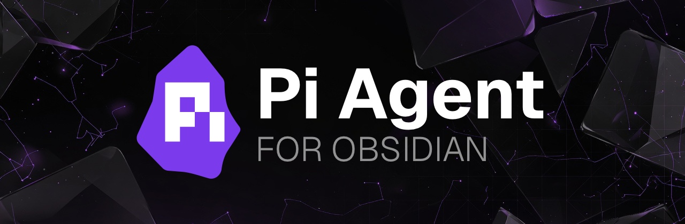

# Pi Agent

Chat with Pi in Obsidian using context from your current note, links, backlinks, tags, explicit search results, and selected text.

> Thanks to Mario Zechner, the developer of Pi, for building the agent this plugin runs on top of.

## Requirements

Pi Agent is desktop-only and requires Pi coding agent **0.80.0 or newer** to be installed separately (last compatibility test: **0.80.7**). The upstream package is [`@earendil-works/pi-coding-agent`](https://www.npmjs.com/package/@earendil-works/pi-coding-agent), from [`earendil-works/pi-mono`](https://github.com/earendil-works/pi-mono/tree/main/packages/coding-agent):

```bash
npm install -g @earendil-works/pi-coding-agent
pi --version
```

Newer Pi versions may add capabilities that Pi Agent does not use yet. Missing required RPC capabilities produce an upgrade diagnostic; optional capabilities must use an explicit, tested fallback rather than failing silently.

If Obsidian cannot find `pi`, restart Obsidian after installation so it picks up your updated PATH. For custom installs such as nix-darwin, set **Pi executable path** in the plugin settings, for example `/etc/profiles/per-user/${USER}/bin/pi`.

First run checklist:

1. Install and authenticate Pi from a terminal.
2. Open a dedicated test vault before enabling Edit or Full agent mode.
3. Start in Chat or Review mode until you understand what context is sent.
4. Enable Edit or Full agent only for vaults/projects you are comfortable letting Pi modify.

Tool modes, briefly:

- Chat attaches Obsidian context only; Pi CLI tools are disabled.
- Review lets Pi read/search/list files.
- Edit lets Pi edit/write files.
- Full agent also lets Pi run shell commands.

Privacy reminder: prompts, selected text, note content, search excerpts, attachments, and local chat history can be sent to the Pi CLI and then to your configured model provider.

## Features

- Chat with Pi from an Obsidian sidebar.
- Attach current-note context automatically.
- Include linked notes, backlinks, tags, frontmatter, headings, selected text, and explicit search attachments.
- Choose tool modes: Chat, Review, Edit, and Full agent.
- Enable default Pi skills and add trusted custom skill folders.
- Use `/` autocomplete for Obsidian context commands and `/skill:name` commands.
- Copy responses, create notes from answers, and open cited vault notes.
- Attach change requests or questions to Markdown selections and source-backed blocks.
- Receive a native completion notification when an agent run finishes while Obsidian is unfocused, where desktop notification permission is available.

### Annotations

Open a Markdown note and select text, then choose the **Annotations** header action to add a change request or question. With no selection, the action toggles block-pick mode; it works in both editing and reading views when Obsidian can map the rendered block to Markdown source. The command palette action **Pi Agent: Add or toggle annotation for active note** is the keyboard/fallback entry point. Annotations appear on the note, can be navigated, edited, or individually deleted, and are included with the active note in subsequent Pi prompts; detached anchors remain listed until edited or deleted.

> Tool modes control which Pi CLI tools are enabled. They are not an operating-system sandbox.

## Privacy and safety

Pi Agent can send note content and selected text to the local Pi CLI, which may forward prompts to configured model providers. See [PRIVACY.md](PRIVACY.md) for details before publishing or using the plugin with sensitive vaults.

Short version:

- The plugin does not include ads, telemetry, or an auto-updater.
- Chat history is stored as one versioned JSON file per chat in the configurable vault-relative `pi_sessions` folder. Pi runtime sessions remain separate under the plugin's local `pi-sessions` directory.
- Network access happens through the separately installed Pi CLI and depends on your Pi/model-provider configuration.
- Pi discovers project/global extensions, prompt templates, and skills through RPC and applies its own project-trust rules. The plugin passes any explicitly configured absolute or vault-contained skill paths to Pi.
- Edit and Full agent modes can modify files in your vault/project.
- Full agent mode enables Pi's complete tool set, including extension/custom tools and shell commands.
- Skills can contain instructions or scripts; only enable skill folders you trust.

## Installation

### Community plugins

After approval, install from Obsidian's Community Plugins browser.

### Manual installation

Download the latest release and copy these files into:

```text
<vault>/.obsidian/plugins/pi-agent/
```

Required files:

```text
main.js
manifest.json
styles.css
```

Then enable **Pi Agent** in Obsidian settings.

## Development

Use a dedicated test vault. Do not develop or test plugin changes in your main vault.

```bash
npm ci
npm run build
npm run build:check
npm run ci
npm run test:pi -- /path/to/dedicated/test-vault
npm run dev:install -- /path/to/dedicated/test-vault/.obsidian/plugins/pi-agent
```

`test:pi` is an opt-in, offline/no-tool/no-session RPC smoke test. It disables discovered extensions, skills, prompt templates, themes, context files, and project approval, then reads local Pi state, models, and commands without sending a model prompt. No provider request is made, so the command does not incur model-provider charges. Then reload Obsidian, or disable and re-enable the plugin.

See [TESTING.md](TESTING.md) for the complete automated and dedicated `ObsidianTesting` manual checklist. Manual validation is pending until every item is explicitly checked; testing does not create a release.

## Release

1. Create a release-prep branch from `main`.
2. Update `manifest.json`, `package.json`, and `versions.json`; promote `CHANGELOG.md` `Unreleased` entries into the new version section.
3. Run:

```bash
npm run ci
```

4. Commit and merge the release prep into `main`.
5. Create and push a matching SemVer tag from `main`, for example:

```bash
git tag 0.0.1
git push origin 0.0.1
```

The release workflow uses the current `CHANGELOG.md` entry as release notes, publishes the Obsidian-supported assets, and generates artifact attestations:

- `main.js`
- `manifest.json`
- `styles.css`
